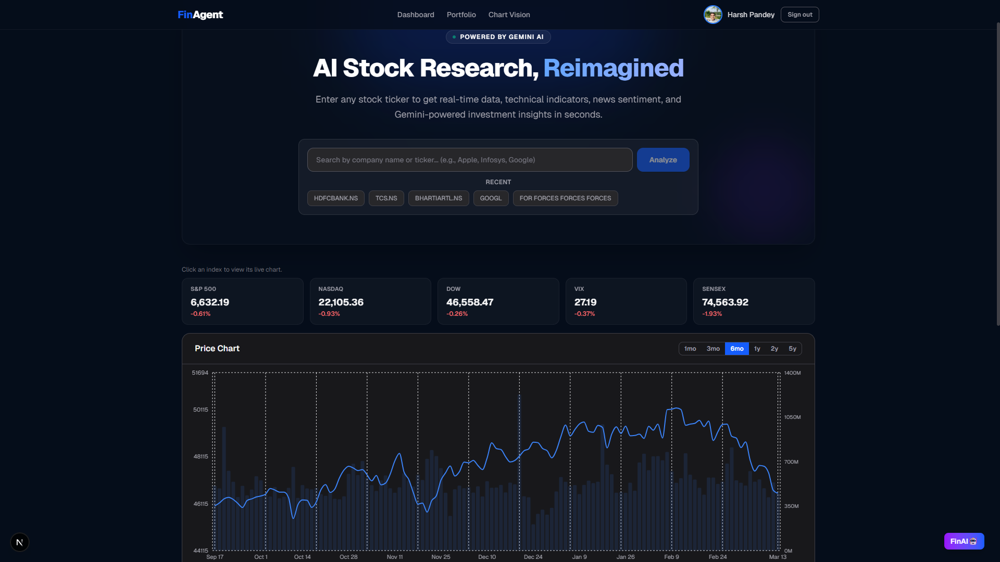
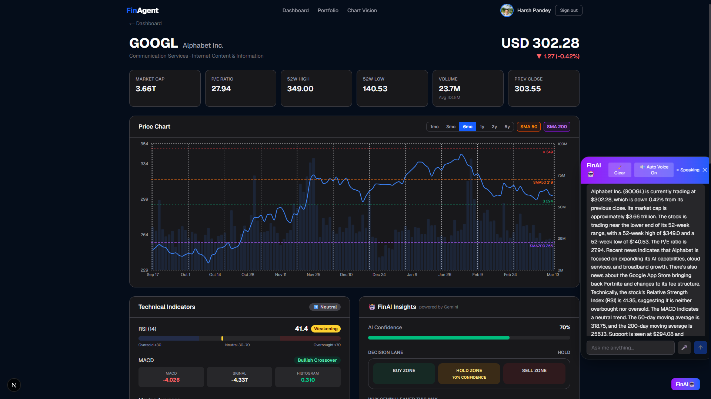
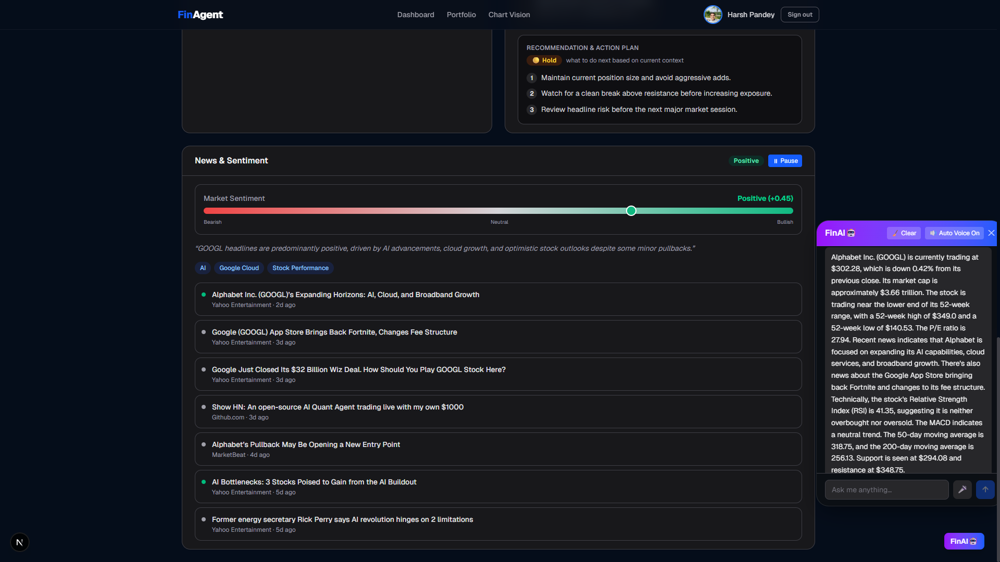
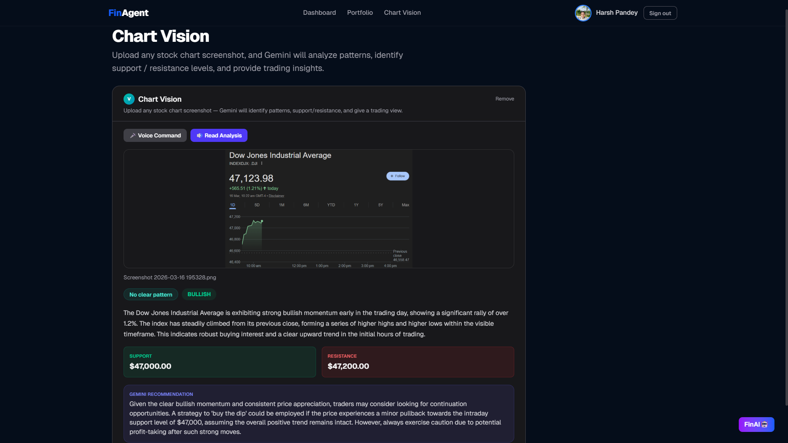
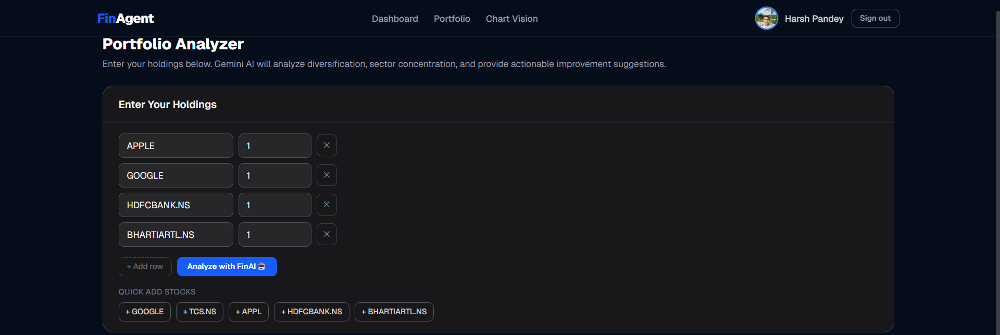
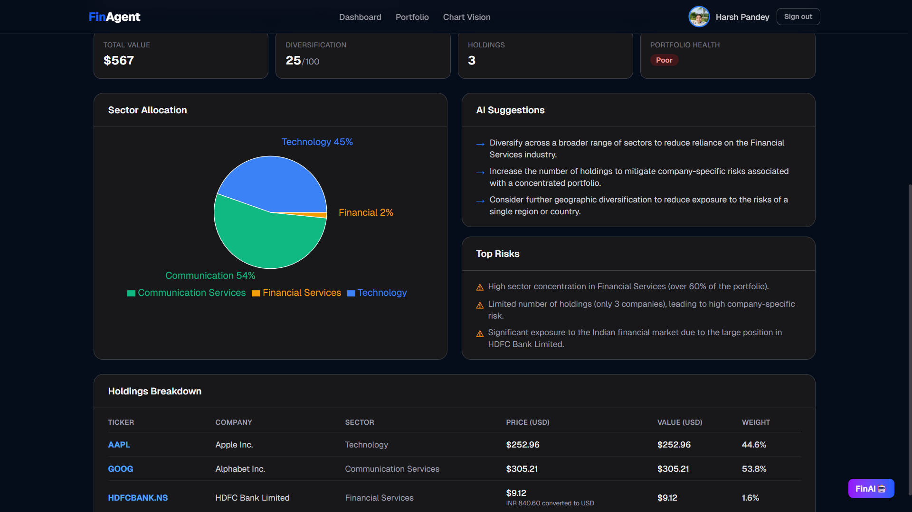
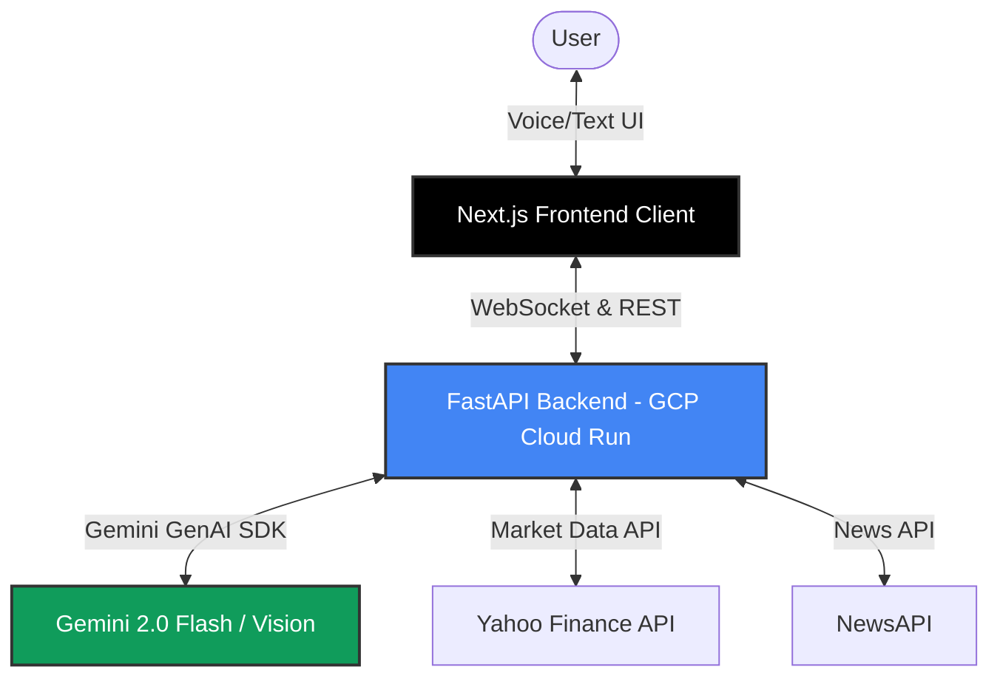

# FinAgent: Gemini-Powered Financial AI Market Intelligence 🚀

## 💡 Pitch
Retail investors are overwhelmed by scattered financial data, complex charts, and fragmented news. FinAgent solves this by providing a unified, multimodal "Live Agent" that acts as your personal financial analyst. It uses Gemini's advanced reasoning to instantly parse local market contexts, execute technical chart vision analyses, and hold real-time bi-directional audio discussions on market movements so you never have to context-switch again.


### 🚀 Live Demo
- **Frontend App:** [https://finagent-frontend-869601020087.us-central1.run.app/](https://finagent-frontend-869601020087.us-central1.run.app/)








---

## 🛠️ Category Selection: Live Agents
**Focus:** Real-time Interaction (Audio/Vision)

FinAgent leverages the continuous Gemini WebSocket Live API and Gemini Vision models to allow users to ask questions interactively using voice, interrupt the agent natively during speech, and upload complex stock charts for immediate visual analysis and trading strategies. 

---

## 🏗️ Architecture Diagram
Below is the high-level architecture of the system:



---

## ⚙️ How It Works (Technologies Used)
- **Frontend**: Next.js 15, TailwindCSS, Web Speech API. Handles bi-directional audio streaming, WebSockets, and UI rendering.
- **Backend**: FastAPI (Python), deployed on **Google Cloud Run**.
- **AI Integration**: Google GenAI SDK (`google-genai`). Implements strict multimodal agent reasoning.
- **Data Layers**: `yfinance` for live stock ticks and `newsapi` for live broad market sentiment.

---

## 🚀 Spin-Up Instructions (Deploy & Run)

Follow these steps to reproduce and run the project locally.

### 1. Prerequisites
- Python 3.12+
- Node.js v20+
- API Keys: Gemini API (Google AI Studio) & NewsAPI

### 2. Backend Setup
1. Navigate to the backend directory:
   ```bash
   cd backend
   ```
2. Create and activate a python virtual environment:
   ```bash
   python -m venv .venv
   source .venv/bin/activate  # Or `.venv\Scripts\activate` on Windows
   ```
3. Install dependencies:
   ```bash
   pip install -r requirements.txt
   ```
4. Set up Environment Variables:
   Create a `.env` file in the `backend/` folder:
   ```env
   GEMINI_API_KEY="your-gemini-key"
   NEWS_API_KEY="your-news-api-key"
   ```
5. Run the server:
   ```bash
   uvicorn app.main:app --host 0.0.0.0 --port 8000 --reload
   ```

### 3. Frontend Setup
1. Open a new terminal and navigate to the frontend directory:
   ```bash
   cd frontend
   ```
2. Install dependencies:
   ```bash
   npm install
   ```
3. Point to your backend:
   Create a `.env.local` inside the `frontend/` folder:
   ```env
   NEXT_PUBLIC_API_URL="http://localhost:8000"
   ```
4. Start the app:
   ```bash
   npm run dev
   ```
5. Open `http://localhost:3000` to interact with FinAgent!

---

## ☁️ Google Cloud Deployment
This project is fully automated for Google Cloud Run. 
- **Backend:** Deployed via Cloud Run using `Dockerfile`.
- **Frontend:** Deployed via Cloud Run using `frontend.Dockerfile` and `cloudbuild.yaml`.

---

## 📚 Key Learnings
Building FinAgent taught us how incredibly powerful Gemini's contextual awareness is when paired with high-velocity data. Interleaving live ticker data securely into a persistent system prompt, and keeping a bi-directional audio WebSocket pipeline stable required heavy architectural considerations that radically differ from typical REST API applications!
